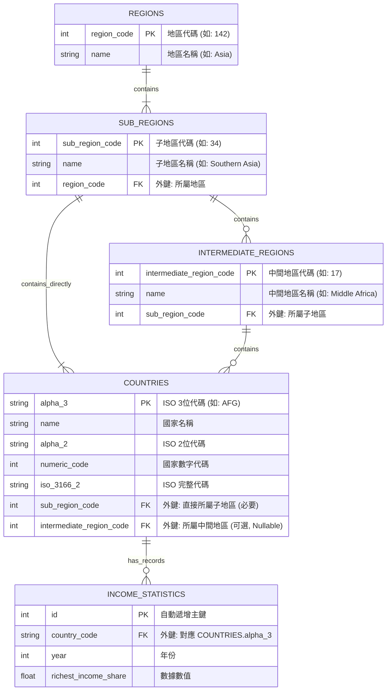

# FinalExam
FinalExam_README



# Global Income Share Database ETL Project

This project contains an ETL (Extract, Transform, Load) process for analyzing global income inequality data. The process transforms raw CSV data into a normalized MySQL database schema.

## Prerequisites

- Docker and Docker Compose installed on your system
- Git (for cloning the repository)

## Project Structure

├── README.md                    # This file
├── documentation.md             # Detailed ETL process documentation
├── docker-compose.yml           # Docker configuration
└── data-files/
    ├── data1.csv                # Source data: Historical income share data
    ├── data2.csv                # Source data: Country ISO codes and regions
    ├── ddl.sql                  # Database schema definition
    └── etl.sql                  # ETL process script

## Getting Started

### Step 1: Start Docker Environment

Start the MySQL database container using Docker Compose:

bash
docker-compose up -d


This command will set up the database with credentials similar to the reference project:
- Database: `global_economy`
- Username: `user`
- Root password: `root`
- Mounts the `data-files` directory to `/var/lib/mysql-files` inside the container

### Step 2: Verify Container is Running

Check that the container is running properly:

bash
docker-compose ps


### Step 3: Access MySQL Container

Connect to the MySQL container to run the ETL process:

bash
docker exec -it global-db mysql -u root -p


When prompted, enter the root password: `root`

### Step 4: Set Up Database Schema

Inside the MySQL prompt, create the database schema:

```sql
-- Create database and tables
CREATE DATABASE IF NOT EXISTS global_economy;
USE global_economy;

-- 1. Create Countries Table (Dimension) from data2.csv structure
CREATE TABLE countries (
    alpha_3 CHAR(3) PRIMARY KEY,
    name VARCHAR(100),
    alpha_2 CHAR(2),
    region VARCHAR(50),
    sub_region VARCHAR(50)
);

-- 2. Create Statistics Table (Fact) from data1.csv structure
CREATE TABLE income_statistics (
    stat_id INT AUTO_INCREMENT PRIMARY KEY,
    country_code CHAR(3),
    year INT,
    richest_income_share DECIMAL(10, 4),
    FOREIGN KEY (country_code) REFERENCES countries(alpha_3)
);

-- 2.1 建立收入數據暫存表 (對應 data1.csv)
CREATE TABLE temp_income_stats (
    entity VARCHAR(255),
    code VARCHAR(10),
    year INT,
    richest_income_share DECIMAL(10, 4)
);

-- 2.2 建立國家元數據暫存表 (對應 data2.csv)
-- 注意：這裡的所有欄位都設為 VARCHAR 或 TEXT，以避免載入時因格式問題報錯
CREATE TABLE temp_country_metadata (
    name VARCHAR(255),
    alpha_2 VARCHAR(10),
    alpha_3 VARCHAR(10),
    country_code INT,
    iso_3166_2 VARCHAR(50),
    region VARCHAR(100),
    sub_region VARCHAR(100),
    intermediate_region VARCHAR(100),
    region_code VARCHAR(10),
    sub_region_code VARCHAR(10),
    intermediate_region_code VARCHAR(10)
);

-- 3.1 載入 data1.csv
LOAD DATA INFILE '/var/lib/mysql-files/data1.csv'
INTO TABLE temp_income_stats
FIELDS TERMINATED BY ',' 
ENCLOSED BY '"'
LINES TERMINATED BY '\n'
IGNORE 1 ROWS;

-- 3.2 載入 data2.csv
LOAD DATA INFILE '/var/lib/mysql-files/data2.csv'
INTO TABLE temp_country_metadata
FIELDS TERMINATED BY ',' 
ENCLOSED BY '"'
LINES TERMINATED BY '\n'
IGNORE 1 ROWS;

-- 4.1 建立最上層地區表 (REGIONS)
CREATE TABLE regions (
    region_code INT PRIMARY KEY,
    name VARCHAR(100) NOT NULL
);

-- 4.2 建立子地區表 (SUB_REGIONS) - 連結 REGIONS
CREATE TABLE sub_regions (
    sub_region_code INT PRIMARY KEY,
    name VARCHAR(100) NOT NULL,
    region_code INT,
    FOREIGN KEY (region_code) REFERENCES regions(region_code)
);

-- 4.3 建立中間地區表 (INTERMEDIATE_REGIONS) - 連結 SUB_REGIONS
CREATE TABLE intermediate_regions (
    intermediate_region_code INT PRIMARY KEY,
    name VARCHAR(100) NOT NULL,
    sub_region_code INT,
    FOREIGN KEY (sub_region_code) REFERENCES sub_regions(sub_region_code)
);

-- 4.4 建立國家表 (COUNTRIES) - 核心維度表
CREATE TABLE countries (
    alpha_3 CHAR(3) PRIMARY KEY,
    name VARCHAR(100) NOT NULL,
    alpha_2 CHAR(2),
    numeric_code INT,
    iso_3166_2 VARCHAR(20),
    sub_region_code INT,       -- 每個國家一定屬於一個子地區
    intermediate_region_code INT NULL, -- 中間地區是可選的 (Nullable)
    FOREIGN KEY (sub_region_code) REFERENCES sub_regions(sub_region_code),
    FOREIGN KEY (intermediate_region_code) REFERENCES intermediate_regions(intermediate_region_code)
);

-- 4.5 建立收入統計表 (INCOME_STATISTICS) - 事實表
CREATE TABLE income_statistics (
    stat_id INT AUTO_INCREMENT PRIMARY KEY,
    country_code CHAR(3),
    year INT,
    richest_income_share DECIMAL(10, 4),
    FOREIGN KEY (country_code) REFERENCES countries(alpha_3)
);

-- 5.1 載入地區 (Regions)
-- 使用 DISTINCT 去除重複，並過濾掉空值
INSERT INTO regions (region_code, name)
SELECT DISTINCT region_code, region
FROM temp_country_metadata
WHERE region_code != '' AND region_code IS NOT NULL;

-- 5.2 載入子地區 (Sub-Regions)
INSERT INTO sub_regions (sub_region_code, name, region_code)
SELECT DISTINCT sub_region_code, sub_region, region_code
FROM temp_country_metadata
WHERE sub_region_code != '' AND sub_region_code IS NOT NULL;

-- 5.3 載入中間地區 (Intermediate Regions)
INSERT INTO intermediate_regions (intermediate_region_code, name, sub_region_code)
SELECT DISTINCT intermediate_region_code, intermediate_region, sub_region_code
FROM temp_country_metadata
WHERE intermediate_region_code != '' AND intermediate_region_code IS NOT NULL;

-- 5.4 載入國家 (Countries)
-- 這裡需要處理 intermediate_region_code 可能為空字串的情況，將其轉為 NULL
INSERT INTO countries (alpha_3, name, alpha_2, numeric_code, iso_3166_2, sub_region_code, intermediate_region_code)
SELECT 
    alpha_3,
    name,
    alpha_2,
    country_code,
    iso_3166_2,
    sub_region_code,
    NULLIF(intermediate_region_code, '') -- 如果是空字串則轉為 NULL
FROM temp_country_metadata
WHERE alpha_3 != '';

-- 5.5 載入收入統計數據 (Income Statistics)
-- 僅載入能在 countries 表中找到對應代碼的數據 (過濾掉無法對應的地區匯總數據)
INSERT INTO income_statistics (country_code, year, richest_income_share)
SELECT 
    t.code,
    t.year,
    t.richest_income_share
FROM temp_income_stats t
JOIN countries c ON t.code = c.alpha_3;

docker exec -it novasphere-db mysql -u root -p
# 輸入密碼: root

SOURCE /var/lib/novasphere-files/etl.sql;

-- 7.1 檢查各表筆數
SELECT 'Regions' as Entity, COUNT(*) as Count FROM regions
UNION ALL
SELECT 'Sub Regions', COUNT(*) FROM sub_regions
UNION ALL
SELECT 'Intermediate Regions', COUNT(*) FROM intermediate_regions
UNION ALL
SELECT 'Countries', COUNT(*) FROM countries
UNION ALL
SELECT 'Income Statistics', COUNT(*) FROM income_statistics;

-- 7.2 驗證 3NF 關聯性：查詢 "亞洲 (Asia)" 下所有國家的 2022 年收入數據
-- 這個查詢證明了從 Statistics -> Countries -> SubRegions -> Regions 的完整路徑
SELECT 
    r.name AS Region,
    sr.name AS Sub_Region,
    c.name AS Country,
    s.year,
    s.richest_income_share
FROM income_statistics s
JOIN countries c ON s.country_code = c.alpha_3
JOIN sub_regions sr ON c.sub_region_code = sr.sub_region_code
JOIN regions r ON sr.region_code = r.region_code
WHERE r.name = 'Asia' AND s.year = 2022
ORDER BY s.richest_income_share DESC
LIMIT 5;
```
