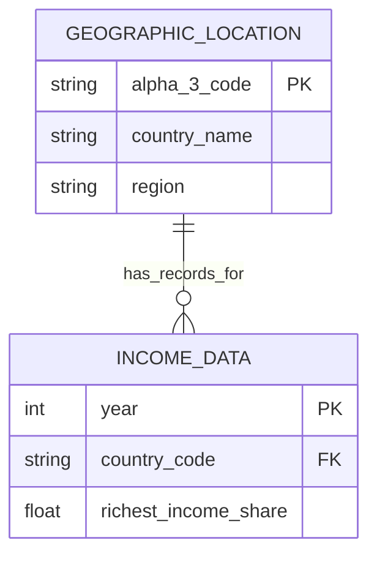

# FinalExam
FinalExam_README

```python
import pandas as pd

# 1. 讀取資料
# 請確保 data1.csv 與 data2.csv 位於與腳本相同的目錄下
df_income = pd.read_csv('data1.csv')
df_geo = pd.read_csv('data2.csv')

# 2. 資料前處理 (Transform)
# 重新命名地理資料的欄位，以符合合併需求
df_geo.rename(columns={'alpha-3': 'Code', 'name': 'Standard_Country_Name'}, inplace=True)

# 只保留需要的地理資訊欄位，避免合併後資料表過於雜亂
geo_cols = ['Code', 'Standard_Country_Name', 'region', 'sub-region']
df_geo_clean = df_geo[geo_cols]

# 3. 資料合併 (Merge)
# 使用 Left Join 保留 income data 的所有列 (包含 World 等非國家實體)
df_merged = pd.merge(df_income, df_geo_clean, on='Code', how='left')

# 4. 資料標記與清理
# 新增 Location_Type 欄位，用來區分「單一國家」與「區域/總合數據」
df_merged['Location_Type'] = df_merged['region'].apply(
    lambda x: 'Country' if pd.notnull(x) else 'Region/Aggregate'
)

# 填補地理資訊的缺失值 (針對非國家實體填寫 Global/Other)
df_merged['region'] = df_merged['region'].fillna('Global/Other')
df_merged['sub-region'] = df_merged['sub-region'].fillna('Global/Other')

# 5. 輸出結果 (Load)
df_merged.to_csv('processed_income_data.csv', index=False)

print("ETL Process Completed. File saved as 'processed_income_data.csv'.")
```


